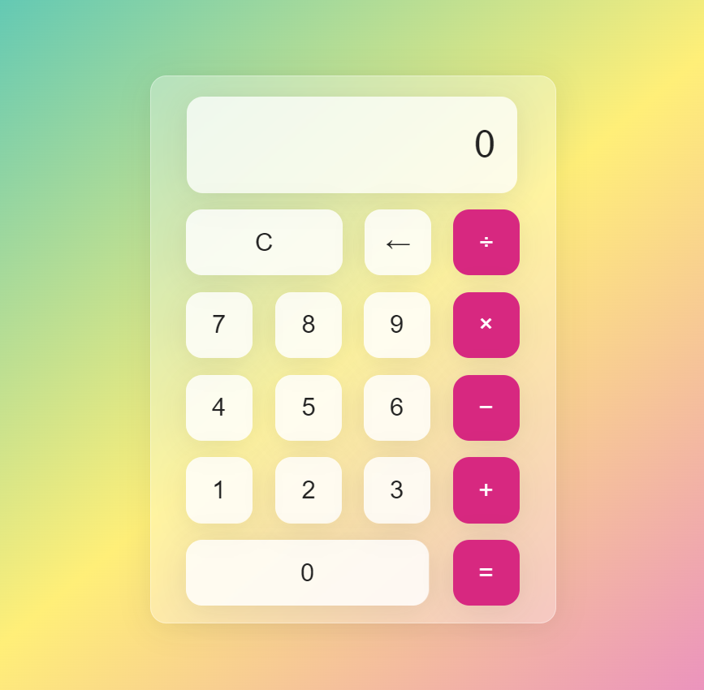

# CODING-SAMURAI-INTERNSHIP-TASK
Internship Oct 6- Nov 6, 2024 at Coding Samurai.  

  

# Calculator App

  

### Overview

This calculator app provides a user-friendly interface for performing basic arithmetic calculations. It includes features like addition, subtraction, multiplication, division, and the ability to handle decimal numbers.

  

### Technologies Used

* **HTML**: Structure and layout of the calculator interface.

* **CSS**: Styling and theming of the calculator, including button colors, fonts, and spacing.

* **JavaScript**: Handles the logic behind calculations, button clicks, and user input.

### Installation

**Clone the Repository**: Download the project files from the GitHub repository.

**Open in a Web Browser**: Open the index.html file in your preferred web browser.

### Usage

*Input*: Click on the number buttons to enter the desired value.

*Operation*: Select the desired arithmetic operation (add, subtract, multiply, or divide).

*Continue Input*: Enter the second value for the calculation.

*Equals*: Click the equals button to perform the calculation and display the result.

*Clear*: Click the clear button to reset the calculator and start a new calculation.

### Features

*Basic Arithmetic*: Addition, subtraction, multiplication, and division.

*Clear Button*: Resets the calculator to its initial state.

*User-Friendly Interface*: Intuitive layout and easy-to-use buttons.

### Additional Notes

*Error Handling*: The calculator may have limitations in handling certain input combinations or errors.

*Customization:* You can modify the CSS styles to customize the appearance of the calculator.

*Enhancements*: Consider adding features like parentheses, exponents, or trigonometric functions for advanced calculations.

**Enjoy using the calculator app!**
